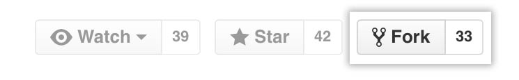

Contributing to a2a-java
==================================

Welcome to the A2A Java SDK project! We welcome contributions from the community. This guide will walk you through the steps for getting started on our project.

- [Forking the Project](#forking-the-project)
- [Issues](#issues)
    - [Good First Issues](#good-first-issues)
- [Setting up your Developer Environment](#setting-up-your-developer-environment)
- [Contributing Guidelines](#contributing-guidelines)
- [Community](#community)


## Forking the Project
To contribute, you will first need to fork the [a2a-java](https://github.com/a2aproject/a2a-java) repository.

This can be done by looking in the top-right corner of the repository page and clicking "Fork".


The next step is to clone your newly forked repository onto your local workspace. This can be done by going to your newly forked repository, which should be at `https://github.com/USERNAME/a2a-java`.

Then, there will be a green button that says "Code". Click on that and copy the URL.

Then, in your terminal, paste the following command:
```bash
git clone [URL]
```
Be sure to replace [URL] with the URL that you copied.

Now you have the repository on your computer!

## Issues
The `a2a-java` project uses GitHub to manage issues. All issues can be found [here](https://github.com/a2aproject/a2a-java/issues).

To create a new issue, comment on an existing issue, or assign an issue to yourself, you'll need to first [create a GitHub account](https://github.com/).


### Good First Issues
Want to contribute to the a2a-java project but aren't quite sure where to start? Check out our issues with the `good-first-issue` label. These are a triaged set of issues that are great for getting started on our project. These can be found [here](https://github.com/a2aproject/a2a-java/issues?q=is%3Aissue%20state%3Aopen%20label%3A%22good%20first%20issue%22).

Once you have selected an issue you'd like to work on, make sure it's not already assigned to someone else, and assign it to yourself.

It is recommended that you use a separate branch for every issue you work on. To keep things straightforward and memorable, you can name each branch using the GitHub issue number. This way, you can have multiple PRs open for different issues. For example, if you were working on [issue-20](https://github.com/a2aproject/a2a-java/issues/20), you could use `issue-20` as your branch name.

## Setting up your Developer Environment
You will need:

* Java 17+
* Git
* An IDE (e.g., IntelliJ IDEA, Eclipse, VSCode, etc.)

To set up your development environment you need to:

1. First `cd` to the directory where you cloned the project (eg: `cd a2a-java`)

2. Add a remote ref to upstream, for pulling future updates. For example:

    ```
    git remote add upstream https://github.com/a2aproject/a2a-java
    ```

3. To build `a2a-java` and run the tests, use the following command:

    ```
    mvn clean install
    ```

4. To skip the tests:

    ```
    mvn clean install -DskipTests=true
    ```

## Contributing Guidelines

When submitting a PR, please keep the following guidelines in mind:

1. In general, it's good practice to squash all of your commits into a single commit. For larger changes, it's ok to have multiple meaningful commits. If you need help with squashing your commits, feel free to ask us how to do this on your pull request. We're more than happy to help!

2. Please link the issue you worked on in the description of your pull request and in your commit message. For example, for issue-20, the PR description and commit message could be: ```Add tests to A2AClientTest for sending a task with a FilePart and with a DataPart
 Fixes #20```

3. Your PR should include tests for the functionality that you are adding.

4. Your PR should include appropriate [documentation](https://github.com/a2aproject/a2a-java/blob/main/README.md) for the functionality that you are adding.

## Code Reviews

All submissions, including submissions by project members, need to be reviewed by at least one `a2a-java` committer before being merged.

The [GitHub Pull Request Review Process](https://docs.github.com/en/pull-requests/collaborating-with-pull-requests/reviewing-changes-in-pull-requests/about-pull-request-reviews) is followed for every pull request.
